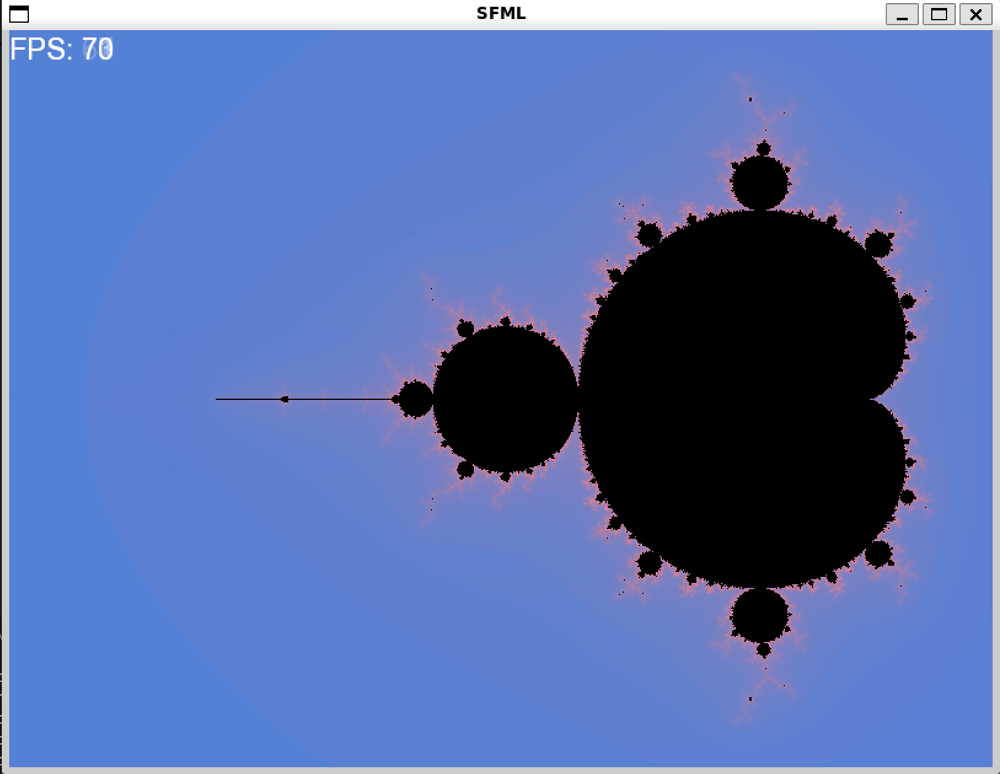
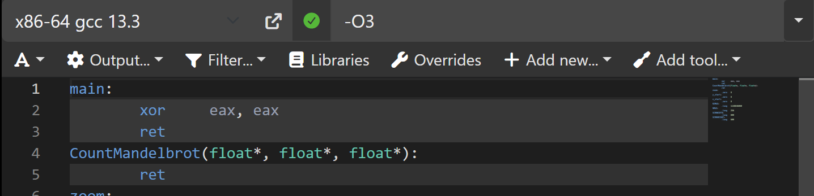
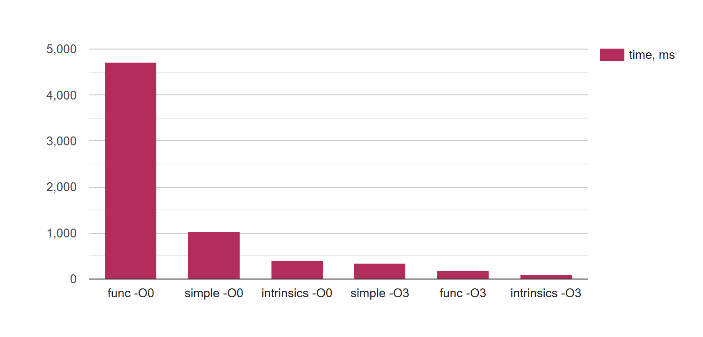
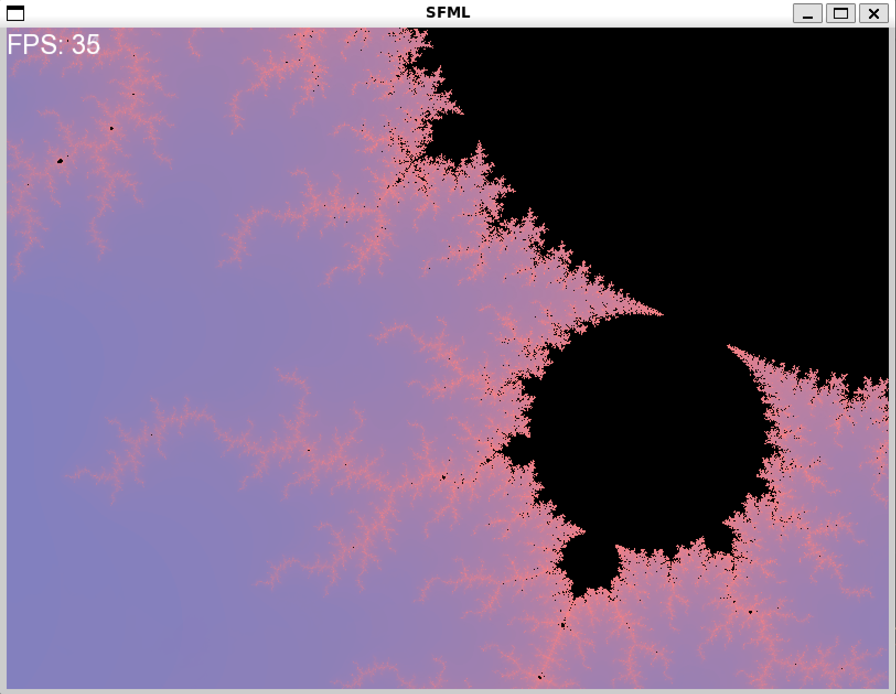
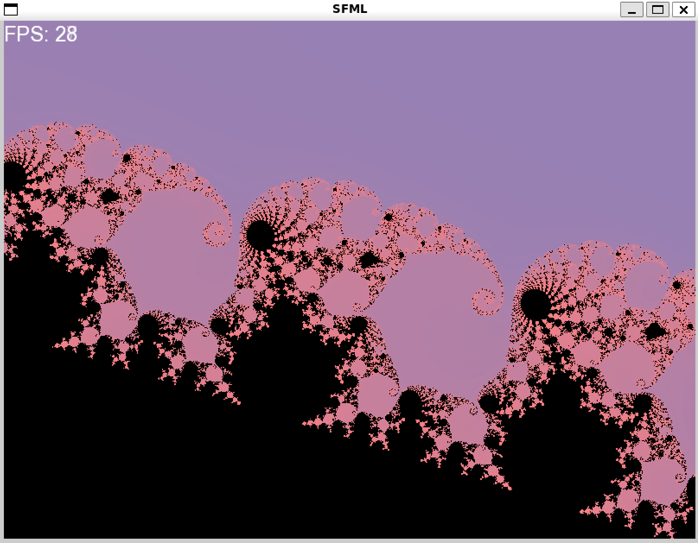

# Изучение SIMD инструкций на примере множества Мандельброта
Цель работы: Исследовать влияние разных оптимизаций на скорость вычисления множества Мандельброта. 


## Содержание
- [Технологии](#технологии)
- [Начало работы](#начало-работы)
- [Тестирование](#тестирование)
- [Deploy и CI/CD](#deploy-и-ci/cd)
- [Contributing](#contributing)
- [To do](#to-do)
- [Команда проекта](#команда-проекта)

## Алгоритм
1) $p_0$ - некоторая произвольная точка комплексной плоскости
2) для вычисления следующих точек множества Мандельброта воспользуемся рекуррентным соотношением: $p_{n+1} = p_n^2 + p_0$
3) считаем модуль комплексного числа и сравниваем с некоторым значением (максимальным радиусом окружности, задающим область вычислений): if $|p_n|$ > $i_{max}$ ...
4) устанавливаем цвет пикселя в зависимости от положения точки
5) выводим на экран раскрашенные пиксели

## Режимы работы
### Обычный режим:
Создается окно для рисования множества Мандельброта. В верхнем левом углу записывается значение FPS (количество кадров в секунду), за изменением этого числа интересно наблюдать при передвижении изображения. Изображением в окне можно управлять при помощи клавиатуры:
`↑` - сдвинуть картинку вверх;

`↓` - сдвинуть картинку вниз;

`←` - сдвинуть картинку влево;

`→` - сдвинуть картинку вправо;

`-` - отдалить картинку;

`=` - приблизить картинку; 

### NOPICTURE режим:
Картинка в окне не рисуется, массив цветов не заполняется, 500 раз запускаются вычисления с замером времени, в консоль выводится время каждого замера и среднее.

### Примечание
Чтобы компилятор не портил наши измерения, нужно воспользоваться ключевым словом volatile, которое запретит ему оптимизировать некоторые переменные. Вот так хорошо компилятор оптимизирует при -O3 функцию CountMandelbrot(...) в режиме без отрисовки:

Ну да, и правда, зачем считать, если можно не считать.. 

## simple_version
В этой версии потихонечку, не торопясь, без суеты обрабатывается по одному пикселю за цикл.
```
void CountMandelbrot(float* x_start, float* y_start, float* zoom,  sf::Uint8* src) 
{ 
    float dx = 0.001f / float(*zoom), 
          dy = 0.001f / float(*zoom);

    for (volatile int iy = 0; iy < SCRNHEIGHT; iy++)
    {     
        float x0 = (( float(*x_start) * (*zoom) - (float)(SCRNWIDTH / 2)) * dx);
        float y0 = ((float)iy + float(*y_start) * (*zoom) - (float)(SCRNHEIGHT / 2)) * dy;

        for (volatile int ix = 0; ix < SCRNWIDTH; ix++, x0 += dx)
        {
            float x = x0,
                  y = y0;

            volatile int n = 0;

            for (; n < NMAX; n++)
            {
                float x2 = x * x,
                      y2 = y * y,
                      xy = x * y;

                float r2 = x2 + y2;

                if (r2 >= R2MAX) break;

                x = x2 - y2 + x0;
                y = xy + xy + y0;

            }

            #ifndef NOPICTURE
            //...set color...
            #endif
        }
    }

}
```
Компилятор ускорил рассчеты почти в 3 раза, достойно.
| Опция компилятора       | $t$, мс  | 
|:-----------------------:|:--------:|
|  -O3                    |353.040253| 
|  -O0                    |1044.197876|


## vers_func
Вот это уже что-то покруче, вычисления происходят для наборов из 8-ми точек, каждый элемент массива всё равно, конечно, обрабатывается отдельно, но, как видно из результатов измерений, компилятор догадался до лучшей оптимизации. 
```
void CountMandelbrot (float* x_start, float* y_start, float* zoom, sf::Uint8* src) 
{ 
    float dx = 0.001f / float(*zoom), 
          dy = 0.001f / float(*zoom);

    for (volatile int iy = 0; iy < SCRNHEIGHT; iy++) 
    {    
        float DX[8] = {}; mm_set_ps1(DX, dx); mm_mul_ps(DX, DX, (float*)arr01234567);

        float x0 = (( float(*x_start) * (*zoom) - (float)(SCRNWIDTH / 2)) * dx);
        float y0 = ((float)iy + float(*y_start) * (*zoom) - (float)(SCRNHEIGHT / 2)) * dy;
        
        for (volatile int ix = 0; ix < SCRNWIDTH; x0 += dx * 8) 
        {
            float X0[8] = {}; mm_set_ps1(X0, x0); mm_add_ps(X0, X0, DX);
            float Y0[8] = {}; mm_set_ps1(Y0, y0);
            
            float X[8] = {}; mm_cpy_ps(X, X0);
            float Y[8] = {}; mm_cpy_ps(Y, Y0);
            int N[8] = {0};

            for (volatile int n = 0; n < NMAX; n++) {
                float X2[8] = {}; mm_mul_ps(X2, X, X);
                float Y2[8] = {}; mm_mul_ps(Y2, Y, Y);
                float XY[8] = {}; mm_mul_ps(XY, X, Y);

                float R2[8] = {}; mm_add_ps(R2, X2, Y2);

                int cmp[8] = {}; mm_cmp_ps(R2, cmp);
                
                int mask = mm_movemask_ps(cmp);
                if (!mask) break;

                mm_add_ps((float*)N, (float*)N, (float*)cmp);

                mm_sub_ps(X, X2, Y2); mm_add_ps(X, X, X0);
                mm_add_ps(Y, XY, XY); mm_add_ps(Y, Y, Y0);
            }

            #ifdef NOPICTURE
            ix += 8;
            #endif
            #ifndef NOPICTURE
            
            sf::Color color;
            for (int i = 0; i < 8; i++, ix++) 
            {
                //...set color...
            }
            #endif
        }
    }
}
```
В этой версии, конечно, компилятор круто постарался, мы получили различие в 24 раза между разными опциями компилятора. Однако время рассчетов по сравнению с simple_version увеличилось в 4.5 раза! Это печально. Почему же при -O0 в этой версии время получилось больше, чем в первой? Мое предположение: во внутреннем цикле мы сравниваем R2 с R2MAX и только когда все 8 значений радиусов достигают предельного - мы переходим к раскраске. То есть некоторые элементы проходят через лишние итерации цикла. По сравнению с simple_version: время при -O3 уменьшилось в 1.8 раза, значит, компилятор распознает наши намеки на использование векторных инструкций.
| Опция компилятора       | $t$, мс  | 
|:-----------------------:|:--------:|
|  -O3                    |193.190186| 
|  -O0                    |4708.687988|

## intrinsics_version
Вашему вниманию представляется самая крутая версия:
```
void CountMandelbrot (float* x_start, float* y_start, float* zoom, sf::Uint8* src) 
{ 
    __m256 r2max = _mm256_set1_ps(10000.0f);
    __m256 arr01234567 = _mm256_set_ps(7.f, 6.f, 5.f, 4.f, 3.f, 2.f, 1.f, 0.f); 

    float dx = 0.001f / float(*zoom), 
          dy = 0.001f / float(*zoom);

    for (volatile int iy = 0; iy < SCRNHEIGHT; iy++) 
    {    
       __m256 DX = _mm256_set1_ps(dx); DX = _mm256_mul_ps(DX, arr01234567);

        float x0 = (( float(*x_start) * (*zoom) - (float)(SCRNWIDTH / 2)) * dx);
        float y0 = ((float)iy + float(*y_start) * (*zoom) - (float)(SCRNHEIGHT / 2)) * dy;
        
        for (volatile int ix = 0; ix < SCRNWIDTH; x0 += dx * 8) 
        {
            __m256 X0 = _mm256_set1_ps(x0); X0 = _mm256_add_ps(X0, DX);
            __m256 Y0 = _mm256_set1_ps(y0);
                
            __m256 X = X0;
            __m256 Y = Y0;
            __m256i N = _mm256_setzero_si256();
            
            for (volatile int n = 0; n < NMAX; n++) 
            {
                __m256 X2 = _mm256_mul_ps(X, X);
                __m256 Y2 = _mm256_mul_ps(Y, Y);
                __m256 XY = _mm256_mul_ps(X, Y);

                __m256 R2 = _mm256_add_ps(X2, Y2);

                __m256 cmp = _mm256_mul_ps(_mm256_cmp_ps(R2, r2max, _CMP_LE_OQ), _mm256_set1_ps(1.f));

                int mask = _mm256_movemask_ps(cmp);
                if (!mask) break;

                N = _mm256_sub_epi32(N, _mm256_castps_si256(cmp));

                X = _mm256_sub_ps(X2, Y2); X = _mm256_add_ps(X, X0);
                Y = _mm256_add_ps(XY, XY); Y = _mm256_add_ps(Y, Y0);
            }

            #ifdef NOPICTURE
            ix += 8;
            #endif
            
            #ifndef NOPICTURE
            sf::Color color;
            
            int iterationsArray[8] = {};
            _mm256_storeu_si256((__m256i*)iterationsArray, N);

            for (int i = 0; i < 8; i++, ix++) 
            {
                //...set color...
            }
            #endif
        }
    }
}
```
По сравнению с самой простой версией уменьшение времени при -O0: в 2.5 раза, при -O3: в 3.5 раза. И оно понятно: почти все арифметические операции в этом коде выполняются при помощи векторных инструкций.
| Опция компилятора       | $t$, мс  | 
|:-----------------------:|:--------:|
|  -O3                    |100.380951| 
|  -O0                    |413.397949|

Для наглядности результатов:



## Вывод
SIMD инструкции показали лучшую скорость во всех вариантах программы. Значит, при оптимизации времени работы программы стоит восмользоваться ими.

 


